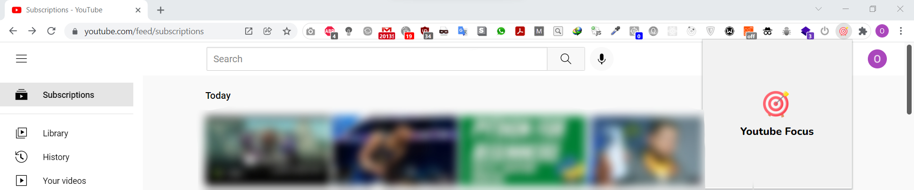
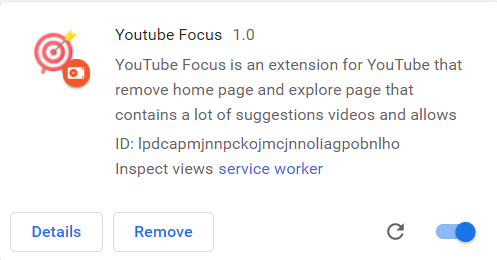

# Youtube Focus

  

  

  
  

`YouTube Focus` is an extension for YouTube that remove home page and explore page that contains a lot of suggestions videos and allows you to <code>focus on</code> your `subscriptions videos` `only`.

---

## ✨ Demo

### 🚀 How to use this extension :

<ol>
  <li><code>install</code> the extension.</li>
  <li>Creating a <code>zip</code> file for our extension.</li>
  <li>open your browser and go to <code>chrome://extensions/ </code></li>
  <li>enable <code>developer mode.</code></li>
  <li><code>click</code> on the <code>"Load unpacked extension"</code> <code>button</code> and select our zip file.</li>
  <li>you will see the <code>extension is loaded.</code></li>
  <li>you can now go to <code>youtube</code> and see the extension is working.</li>
  
</ol>

  
---

### Author

👤 **Osama Mohamed**

- Twitter: [@osamamammar](https://twitter.com/osamamammar)
- Github: [@osamamammar](https://github.com/osamamammar)

#### Show your support

Please ⭐️ this repository if this project helped you!

#### 📝 License

Copyright © 2021 [osamamammar](https://github.com/osamamammar). 
This project is [MIT](https://github.com/osamamammar/extension-youtube-focus/blob/main/LICENSE) licensed.
